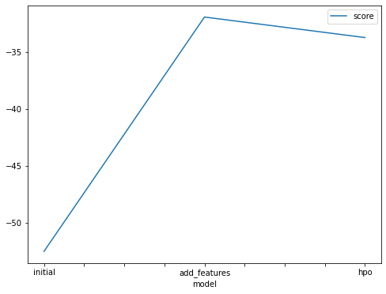
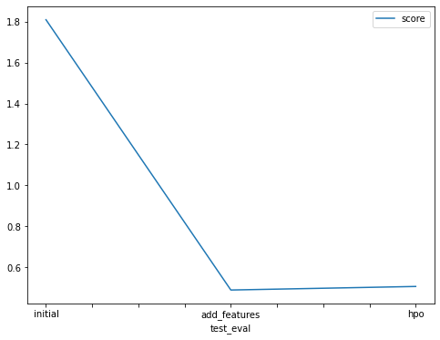

# Report: Predict Bike Sharing Demand with AutoGluon Solution
#### Abdelrahman El-Sheikh

## Initial Training
### What did you realize when you tried to submit your predictions? What changes were needed to the output of the predictor to submit your results?
The predicted values of the bike sharing demand had to be greater than or equal to zero. Therefore, the output dataframe had to be checked if it included negative values. However, in the three cases, there were no negative values in the prediction dataframe.

### What was the top ranked model that performed?
The score of the top ranked model was 1.80851.

## Exploratory data analysis and feature creation
### What did the exploratory analysis find and how did you add additional features?
The exploratory data analysis showed that there were no issues with the dataset, and that most of the continuous variables were normally distributed. However the categorical data were set to category type, and encoded using One Hot Encoder. The year, month, day, and hour were extracted from the date column, and were also used as predictors. Another feature was added which was humidity times temperature. 

### How much better did your model preform after adding additional features and why do you think that is?
The model performed significantly better than the previous model, at a score of 0.48979. That is because the model was able to identify categorical variables, given that their type was changed to category, and that they were encoded. Using the datetime components as predictors must have also contributed to the improvement of the model. Additionally, to account for the high temperature but low humidity levels, and vice versa, an additional feature was added by multiplying the two features. 
## Hyper parameter tuning
### How much better did your model preform after trying different hyper parameters?
The model's performance slightly decreased by a fraction, to be 0.50712. The hyperparameter optimization is currently disabled for RandomForest, ExtraTrees, and kNN, which makes the tuning options limited.
### If you were given more time with this dataset, where do you think you would spend more time?
I would spend more time with both feature engineering, and internal hyperparameters tuning. I would also focus on optimizing the top performing models, like CatBoost. 

### Create a table with the models you ran, the hyperparameters modified, and the kaggle score.
|model|auto_stack|num_stack_levels|num_bag_folds|score|
|--|--|--|--|--|
|initial|False|0|0|1.80851|
|add_features|False|0|0|0.48979|
|hpo|True|3|10|0.50712|

### Create a line plot showing the top model score for the three (or more) training runs during the project.

### Create a line plot showing the top kaggle score for the three (or more) prediction submissions during the project.

## Summary
- The estimated model is significant and can be used to predict the bikeshare demand based on the other independent variables.
- The model's performance signicantly improved after the feature engineering stage, which may indicate further improvements if more features are added, or optimized.
- The autogloun's TabularPredictor hyperparameters didn't significantly affect the model's score.
- Further hyperparameters tuning should be assessed to tune the internal models of TabularPredictor.
- The best performing models in the three cases were WeightedEnsemble_L3, WeightedEnsemble_L2, and CatBoost_BAG_L2, interchangeably.